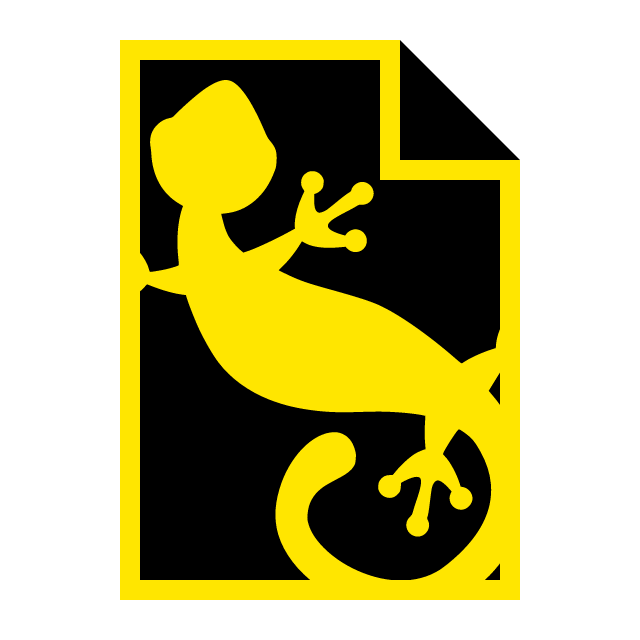
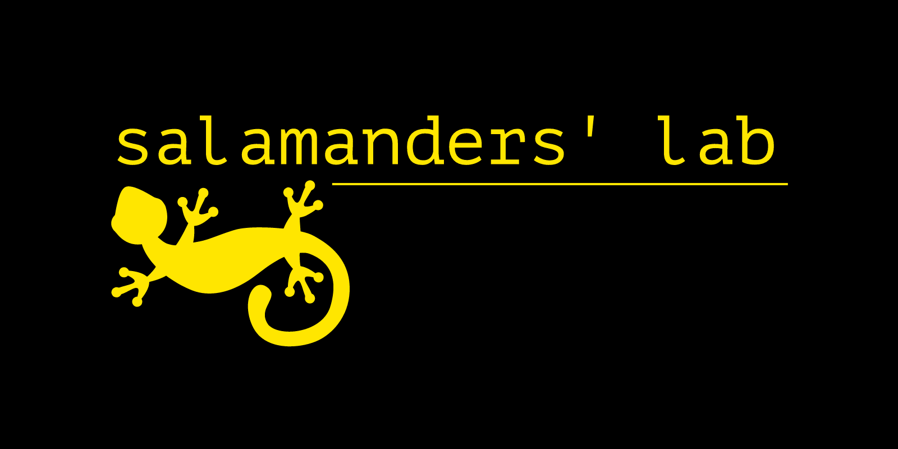

#   SCFE

Documentation website: https://utybo.github.io/scfe-website/ (some links are broken there unfortunately)

## What is this?

Hello! This is the open-source release of my first-year project at EPITA. I'm currently in the third year, but I thought it might be a good idea to release this for educational purposes.

**This release is not maintained.** Feel free to have a look around but don't expect to have something ultra turbo nice. I also made this two years ago, and my code quality standards have vastly improved since then ;)

For context: there is a mandatory programming project during the second semester in groups of four. This is, in 98.5% of cases, a video game done in Unity. However, it is also possible to have other projects if you have a solid case for yourself, although they must be in either OCaml or C#. Our project is *SCFE*, a console-based file explorer (Salmanders' Console File Explorer). There was another project that year that was not a game named [OCalc](https://github.com/et7f3/ocalc)

Our group, "Salamanders' Lab", was about what you expect in this sort of project: two people doing the job, two people doing much. However, this time around, I can't really blame them: I was a very poor project leader there. In a nutshell: I made about all of the code you will find here, and Mathieu (@yxyfer on GitHub) made the website.

The project was graded 19.5 out of 20 (97.5%) for the final defense. However, this was mostly thanks to a really good oral performance from the team. So, thanks guys!

## What does it do?

Let's talk about the project itself: SCFE is a console-based file explorer application that aims to provide a vim-like user experience which would be a little bit more approachable.

It has a lot of the features from traditional file explorers, as well as pretty nice Git integration.

You can find more information on the documentation website: https://utybo.github.io/scfe-website/

I will eventually make a full fledged blog post on what this project is and how it became what it is, with more technical details, but for now, this is all that you get :)

## Repo architecture

This repo contains:

* `handed`: Source files for the various defenses. Compiled versions are available on the documentation website. Note that we used Pandoc to generate LaTeX files, as Markdown can be learnt in 30 seconds, while LaTeX cannot. As I was very bad at bullshitting my way through stuff, the documentation there is actually pretty interesting and not too indigestible.

* `SCFE`: The main solution for the code side of things

    * `Viu`: A simple and probably stupid home-made framework for making nice console GUIs. This is by no means a professional framework, do not use it for actual serious work!

    * `SCFE`: Code for SCFE itself.

* `installer.nsi`: Installation configuration for NSI. To be honest, I completely forgot how this works.

* A bunch of logos and this README

The only thing that was modified from the end of the project is the .NET build config files (.sln and .csproj files).

## Buildling

You'll need .NET Core 3.1 for this. Just run `dotnet run` in SCFE/SCFE and everything should work -- this is a super basic .NET app architecture.

## Screenshots

## Additional links

The following may be of interest:

* [Sources for the website](https://github.com/yxyfer/salamanders-website) and my fork [here](https://github.com/utybo/scfe-website)
* [Website](https://utybo.github.io/scfe-website/), this is a re-upload using GitHub Pages, the original one was hosted on https://samalanders.dev
* Handed documents:
    * [Book of specifications](https://utybo.github.io/scfe-website/ressources/SCFE-Book-Of-Specifications.pdf)
    * [First defense report](https://utybo.github.io/scfe-website/ressources/SCFE-Defense-1.pdf)
    * [Second defense report](https://utybo.github.io/scfe-website/ressources/SCFE-Defense-2.pdf)
    * [Final report (English)](https://utybo.github.io/scfe-website/ressources/SCFE-Final-Presentation-en.pdf)
    * [Rapport de projet (français)](https://utybo.github.io/scfe-website/ressources/SCFE-Final-Presentation-fr.pdf)
* [Project subject](https://github.com/Epidocs/Past-Exams/blob/master/S2/Project/projects-2023-s2-subject-en.pdf) (et en [français](https://github.com/Epidocs/Past-Exams/blob/master/S2/Project/projects-2023-s2-subject-fr.pdf))
